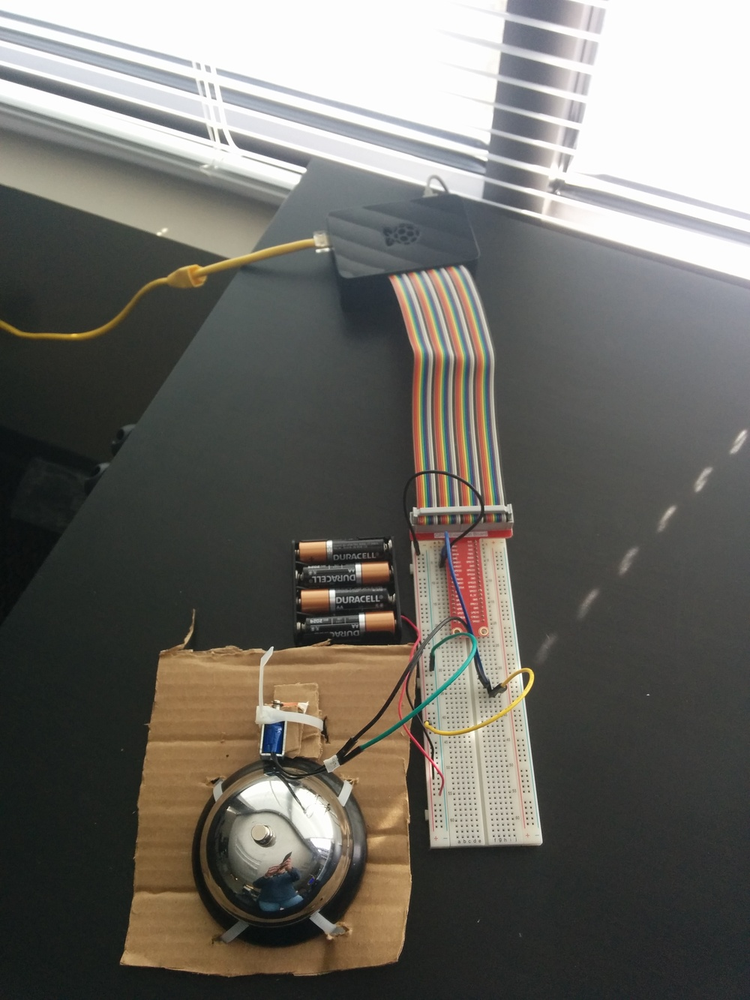

# raspberry-pi-bell-dinger

Your office needs a bell.

This project allows ringing a bell with varying sequences from a Raspberry Pi
using a solenoid. A [Hubot](https://github.com/github/hubot) plugin is
provided so that you can ring the bell from inside [Slack](https://slack.com/).
The Hubot plugin drops a message in [Amazon SQS](https://aws.amazon.com/sqs/)
so that your Raspberry Pi can live behind a NAT without any networking changes.

## Hardware requirements

- Bell
- A solenoid such as https://www.sparkfun.com/products/11015. You could
  order https://www.sparkfun.com/products/10391 if you want a much louder ring.
- A transistor or relay so that the solenoid runs on a separate power supply
  from the Raspberry Pi. Warning: Hooking the solenoid directly to your GPIO
  pins can damaged your Pi.
- The solenoid will need to be mounted next to the bell. For the time being, this is
  done with cardboard and zip ties. 3D-printed mount coming soon from @nyxcharon.

## Software installation on the Raspberry Pi

This was tested on the latest Raspbian based on Debian Jessie:

- Install dependencies: `sudo apt-get install awscli`.
- Add the user that this will run as to the gpio group:
  `sudo usermod -a -G gpio USERNAME`.
- Edit the paths and credential environment variables in the systemd service file
  _raspberry-pi/bell-dinger-sqs.service_.
- Install systemd service:
  -- `sudo cp raspberry-pi/bell-dinger-sqs.service /etc/systemd/system/`
  -- `sudo systemctl daemon-reload`
  -- `sudo systemctl start bell-dinger-sqs.service`

## Slack integration

@alexjpaz - add this section

## Team Members

* [Brian Masney](https://github.com/masneyb)
* [Alex Paz](https://github.com/alexjpaz) - Slack integration
* [Bobby Martin](https://github.com/nyxcharon) - 3D printed mount coming soon

## Images

